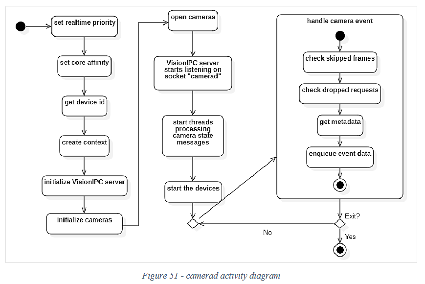
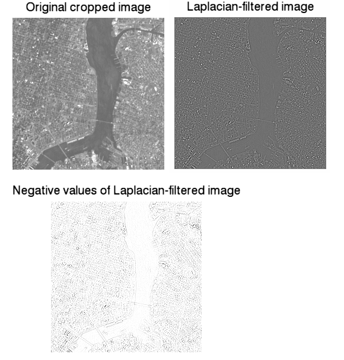

## camerad Module Overview
### **Introduction**
[openpilot](https://github.com/commaai/openpilot/blob/master/README.md) is an 
open-source project focused on self-driving, with one core elements being the 
camera. The camera provides key data about the car's current position and 
the driver's awareness level, which eventually leads to the software making key decisions
on what to do next. In order to better understand how openpilot functions, we decided
to further investigate the [camera](https://github.com/commaai/openpilot/tree/master/system/camerad).

We dive into the five main directories/folders: cameras, test, imgproc, include, snapshot. 

### **cameras Directory**
Inside the [cameras directory](https://github.com/commaai/openpilot/tree/master/system/camerad/cameras), there are 5 main files, each with its key elements. 
All of them have the general purpose of getting and parsing data from the camera 
and configuring the camera.

Camera common ([header file](https://github.com/commaai/openpilot/blob/master/system/camerad/cameras/camera_common.h)) contains functions common to using the camera. 
These functions are about making the camera able to be used by other files.
* [CameraBuf](https://github.com/commaai/openpilot/blob/master/system/camerad/cameras/camera_common.cc#L106): this contains and implements the CameraBuf class, which is a buffer 
which is required for the camera to function
* [fill_frame_data](https://github.com/commaai/openpilot/blob/master/system/camerad/cameras/camera_common.cc#L150): this function will fill the buffer with the camera frame data
* [Threads](https://github.com/commaai/openpilot/blob/master/system/camerad/cameras/camera_common.cc#L304): there are two threads at the end of the file: processing_thread and camera_thread. These threads are used for multithreading, which processing and input data respectively.

The main focus of Camera_qcom2 ([header file](https://github.com/commaai/openpilot/blob/master/system/camerad/cameras/camera_qcom2.h)) is CameraState. CameraState deals with 
setting [exposure](https://github.com/commaai/openpilot/blob/master/system/camerad/cameras/camera_qcom2.cc#L1036), 
[initialization of sensors](https://github.com/commaai/openpilot/blob/master/system/camerad/cameras/camera_qcom2.cc#L200), 
initializing [camera](https://github.com/commaai/openpilot/blob/master/system/camerad/cameras/camera_qcom2.cc#L589), and running the 
[camera](https://github.com/commaai/openpilot/blob/master/system/camerad/cameras/camera_qcom2.cc#L1249). The CameraState object stores information about the current state and 
settings of the camera.

Camera_util ([header file](https://github.com/commaai/openpilot/blob/master/system/camerad/cameras/camera_util.h)) contains low level helper functions used in the camera 
directory. Some key ones include [managing memory](https://github.com/commaai/openpilot/blob/master/system/camerad/cameras/camera_util.cc#L123) 
and [camera control](https://github.com/commaai/openpilot/blob/master/system/camerad/cameras/camera_util.cc#L12).

[Sensor2_i2c](https://github.com/commaai/openpilot/blob/master/system/camerad/cameras/sensor2_i2c.h) contains memory locations of data on the physical camera. It 
is used to properly read and write data to the correct locations.

Finally, the [real_debayer](https://github.com/commaai/openpilot/blob/master/system/camerad/cameras/real_debayer.cl) is the only file that is not C++. It is an OpenCL file, 
and is used for image processing. Debayering is forming a proper image of all data 
received from the RGB sensors ([source](https://www.altairastro.help/why_debayer_before_stacking/)). This debayer deals with [color correction](https://github.com/commaai/openpilot/blob/master/system/camerad/cameras/real_debayer.cl#L9) 
and properly scanning in data.

### **test Directory**
The Python tests inside the test directory mainly apply to the latest comma three hardware. The directory tests everything from exposure correction on individual frames to the processes that start the cameras. 

[test_camerad.py](https://github.com/commaai/openpilot/blob/master/system/camerad/test/test_camerad.py) contains the unit tests that set up the messaging sockets for the road camera, wide road camera, and driver camera. It ensures the daemon for the camerad package starts, stops, and logs every frame properly. Not a single frame can be skipped by any of the cameras. In addition, it checks the difference in time between each frame. If any latency is greater than 0.5 ms, the test_frame_sync unit test fails.

[test_exposure.py](https://github.com/commaai/openpilot/blob/master/system/camerad/test/test_exposure.py) covers color correction and camera snapshots. This file interacts directly with [snapshot.py](https://github.com/commaai/openpilot/blob/10085d1e3f61b472c4f25cd3e98d5ee83b40d4eb/system/camerad/snapshot/snapshot.py#L54) to get each snapshot from each camera. Each image is checked to make sure it is within the specified color ranges. If more than one image doesn’t pass, the unit test fails.

[check_skips.py](https://github.com/commaai/openpilot/blob/master/system/camerad/test/check_skips.py) doesn’t contain any actual tests. Instead, it logs which, if any, frames are skipped by any of the three cameras. It uses openpilot’s [cereal](https://github.com/commaai/cereal) messaging system to debug which sockets might not be working properly.

Lastly, [frame_test.py](https://github.com/commaai/openpilot/blob/master/system/camerad/test/frame_test.py)t validates all the imaging libraries and the camera message publishing system (cereal) is working properly.

### Chronological flow (image processing)
The Comma Device, a.k.a the camera, utilizes the camera daemon to capture both the road and driver camera. The images then undergo processes in the camerad directory such as image extraction in [snapshot](https://github.com/commaai/openpilot/tree/master/system/camerad/snapshot) and image processing in [imgproc](https://github.com/commaai/openpilot/tree/master/system/camerad/imgproc). Lastly, camera daemon uses VisionIPC and the Cereal library to send the frames data to the model daemon, which then computes predictions based on the data. The activity diagram below (source: page 148 of openPilot's official documentation) summarizes the major processes in the camerad module.

### **imgproc Directory**
In the imgproc folder, there contains two .cl files that represent computing language files that are used to compute accelerating speed and responsiveness of applications such as the vision processing and neural network training. The main .cl file, conv.cl, contains code that processes the image. In general, the code functions by reading an RGB image and performs convolution between the kernel and the image. In image processing, a kernel is a small matrix that is used for blurring, sharpening, and edge detection in images. Convolution is a mathematical operation which involves two functions (such as f and g) and produces a third function (f \* g). However, in image processing terms, convolution refers to the process of adding each element of an image to its local neighbors, weighted by the kernel. This relates to the form of the matrix operation used in mathematical convolution.

When convolution is applied, the original image(denoted as f(x,y)) undergoes a specific operation involving the filter kernel (denoted as the omega function, w) that can produce a wide range of effects, producing a filtered image (denoted as g(x,y)). To be put in simpler terms, the conv.cl file in openPilot functions by caching local pixels of an image, comparing the image size to that of the filter size, and finally performing convolution operations. The resulting image from this process will be a weighted sum or combination of all the entries of the image matrix, with weights given by the kernel.

In utils.cc, the file basically works as a utility file that contains helper functions that help perform more complex mathematical operations. The *LapConv* function is a helper function which performs Laplace Transform Convolution, which assists in the convolution of images in the conv.cl file. Laplacian filters are used to detect edges in images. As a spacial filter, it helps to reduce spatial noise and enhance prediction in image processing. As an edge detector, laplacian filters are used to compute second derivatives on an image, measuring the rate at which first derivatives change. This determines if a change in an adjacent pixel values originate from an edge or continuous progression. This is important because each frame being fed into openPilot through the comma device has to be accurately processed continuously to constanly produce accurate and safe predictions for the vehicle. An attached image below explains how laplacian filters affect an image.

### **include Directory**
Inside the [include](https://github.com/commaai/openpilot/tree/master/system/camerad/include) folder, there are five header files and a [media](https://github.com/commaai/openpilot/tree/master/system/camerad/include/media) folder, which contains another 13 header files. These are all used to be included into the rest of the folders. These stubs are mainly used so that the camera sensors and all required headings are included so that the code can call from its appropriate files. 

There are five msm folders that are sensor .h files, these all help to move camerad to the system. The main purpose of this include folder would be to make sure the sensors are being engaged as they are all being defaulted in each file. Inside the media folder, there are all these headers being defined for different parts of the camera family. All hardware stuff, like opcodes and structs, are being created and defined in headers to be used in the other files for sensors. There is not much "logic" code going on in these include files, mainly all .h header files that are just, as the folder name implies, being included.

The five files initially in the root of the include folder:
  * msm_cam_sensor.h - creates many structs and buffers for all of the cam sensors
  * msm_camsensor_sdk.h - creating the headers
  * msmb_camera.h - This one is making sure the stream isn't being over filled, creates buffers and testing situations to avoid overflows.
  * msmb_isp.h - This file includes the linux/videodev2.h header, so it goes into tracking patterns and what to do when stream stopped
  * msmb_ispif.h - Short file. Makes sure proper bits being addressed to. 

The media folder, which includes the 13 .h files, serves so that all the required media that the sensors and camera uses is included. For example, the [cam_jpeg.h](https://github.com/commaai/openpilot/blob/master/system/camerad/include/media/cam_jpeg.h) file makes sure that .jpeg images are supported as a media type. 

Overall, the include folder serves its purpose to include various medias and sensors so that the camerad part of openpilot can function fully and has all the necessary parts to function. 

### **snapshot Directory**
Code Quality

The quality of the code in the camera module is good in the fact that it is readable and takes advantage of using components. One area where the code could improve in quality is in the snapshot.py file. The file is longer than the other files, and it is not as readable. There are variable names in the file that could be named better. For example, line 119 sets two variables, pic and fpic. They could be renamed to rear_pic and front_pic to better represent what they are reffering to.

Snapshot Methods

There are many methods for snapshots to be created and processed for openpilot. The first method is extract_image. It gets the image in YUV and converts it to RGB for processing by calling yuv_to_rgb. The yuv_to_rgb method converts picture from YUV to RGB. YUV images use less bandwidth than RGB images, which will allow the image to be transported faster. The method get_snapshots recieves an image from the rear and front of the vehicle to use for processing and eventually decision making. To create an image memory and save it, jpeg_write is used. The snapshot method works like the main function for snapshots calling all of the other processes and returning the images from get_snapshots.

Main Method

The main method for snapshots works by first checking the hardware it is running on. If it is running on a PC, snapshots are not meant to be taken. Then it sets real time priority to 53. The real time priority works with interupts in the C language and is the precedence of these interupts. Next the core affinity is set to 6, and this is done on the operating system. The next thing that the main method does is check if the car is offroad. The images do not need to be captured if the car is off road because openpilot is not meant for offroading. Lastly, the method calls camera_thread in camera_commons.cc to take pictures and process them.

### **Conclusion**
In conclusion, the camerad module has multiple moving parts that each hold a strong value to maintain a fully functioning camera for openpilot systems. Each of the main directories go hand in hand and we came to learn the purpose of each folder. It breaks down from the initialization and setup of the camera, to the processing of the images, to then include the appropriate file types, and overall testing methods to ensure proper functionality. Overall, the camerad module is a well written piece and the quality of the code remains consistent to the rest of the project. 
